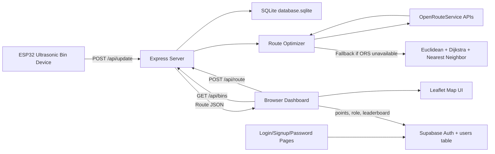
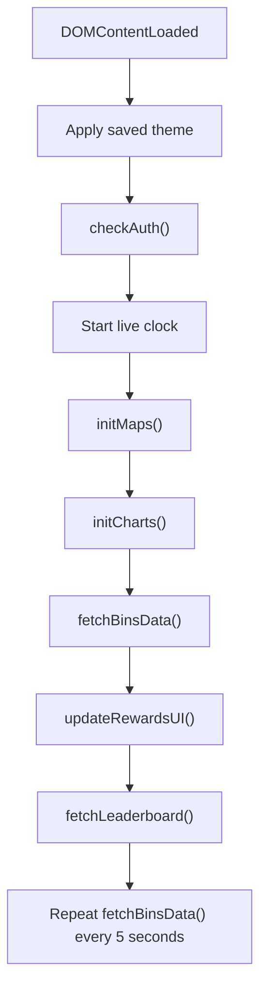
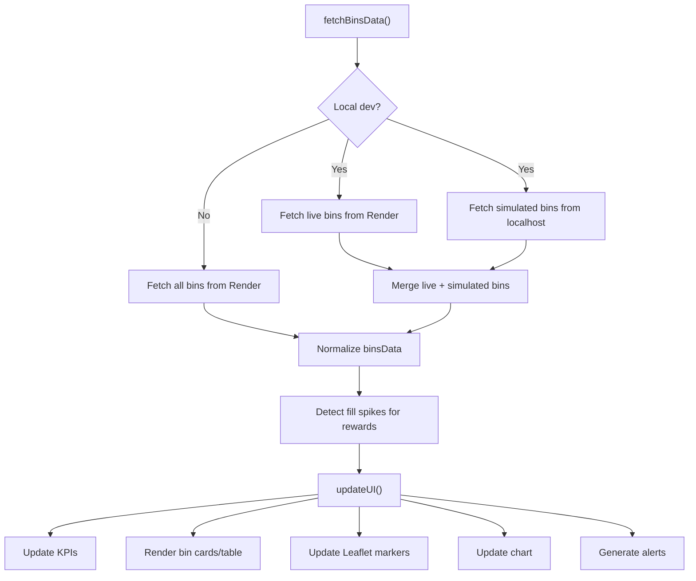
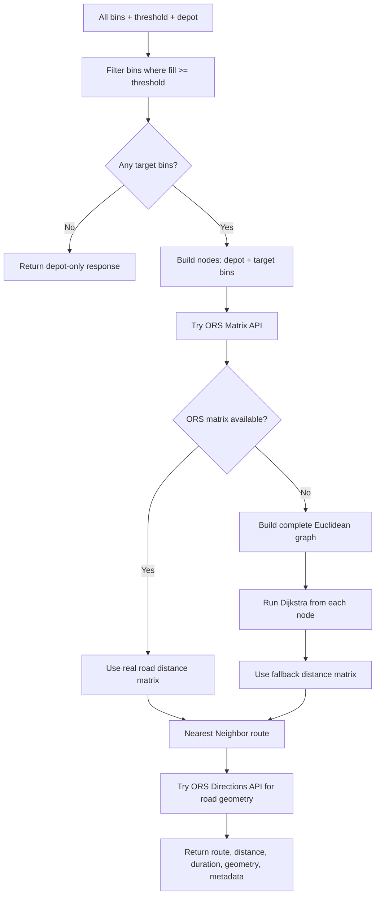
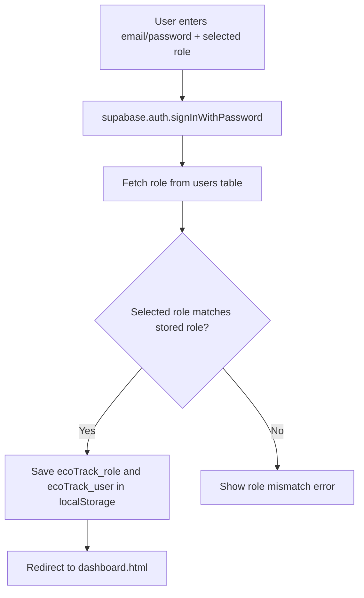
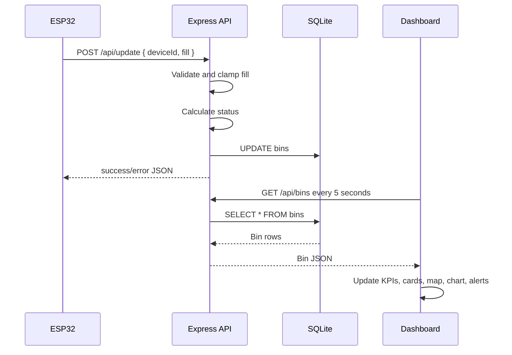
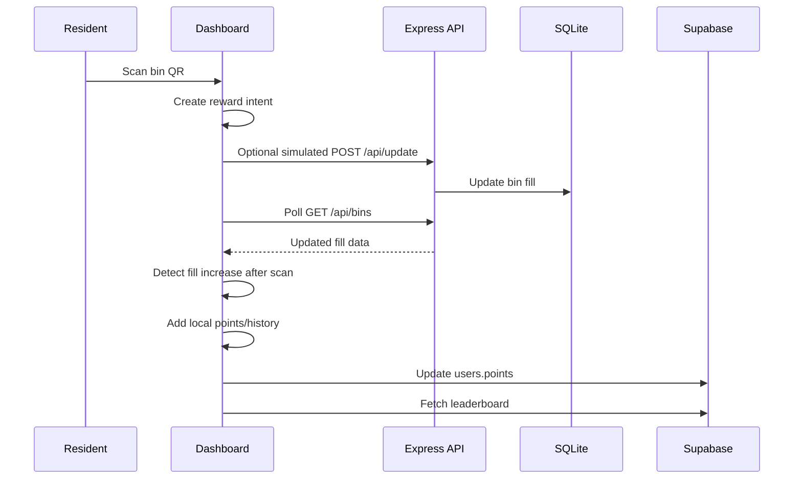

# EcoTrack Complete Documentation

## 1. Project Overview

EcoTrack is a smart waste management system for monitoring waste bin fill levels and optimizing collection routes. The application combines an IoT-style backend, a responsive dashboard, map-based route visualization, role-based user flows, and a rewards system.

The system is designed around three main user needs:

- Residents can view basic dashboard data, scan bin QR codes, and earn EcoPoints.
- Collectors/admin users can monitor bins, inspect alerts, and generate optimized collection routes.
- ESP32 devices can send real-time fill-level updates to the backend.

The current project uses:

- A Node.js/Express backend.
- SQLite for local bin persistence.
- Supabase for authentication, roles, user points, and leaderboard data.
- Leaflet maps with Carto map tiles for bin and route visualization.
- OpenRouteService for real road distance routing when an API key is available.
- A Euclidean/Dijkstra fallback when OpenRouteService is unavailable.

## 2. Repository Structure

```text
ecotrack/
  app.js                  Main dashboard logic and frontend data flow
  dashboard.html          Main authenticated dashboard UI
  style.css               Primary dark/light responsive styling
  light-mode.css          Additional light mode overrides
  server.js               Express API server and SQLite persistence
  routeOptimizer.js       Route optimization pipeline
  orsService.js           OpenRouteService Matrix and Directions API wrapper
  supabase-config.js      Supabase client configuration
  supabase-schema.sql     Supabase users table and RLS policies
  login.html              Supabase login page
  signup.html             Supabase signup page
  forgot-password.html    Password reset request page
  update-password.html    Password update page
  index.html              Landing page
  landing.css             Landing page styling
  package.json            Node dependencies and scripts
  vercel.json             Static hosting config
  README.md               Short project readme
```

## 3. High-Level Architecture



The browser is responsible for presentation, user interaction, maps, role-based page visibility, QR reward logic, and periodic polling. The backend is responsible for bin persistence, device updates, route computation, and serving the static frontend.

## 4. Technology Stack

| Layer | Technology | Purpose |
| --- | --- | --- |
| Frontend | HTML, CSS, Vanilla JavaScript | Dashboard, pages, UI state, role-based navigation |
| Maps | Leaflet | Interactive maps, markers, popups, route drawing |
| Map Tiles | CartoDB basemaps | Light/dark map tile rendering |
| Charts | Canvas-based chart logic in `app.js` | Fill distribution visualization |
| Icons | Font Awesome | Dashboard and control icons |
| QR Scanner | `html5-qrcode` | Resident reward claiming through bin QR scan |
| Backend | Node.js + Express | REST API, static file hosting, route requests |
| Database | SQLite | Bin data persistence for local/server runtime |
| Auth | Supabase Auth | Email/password authentication |
| User Data | Supabase `users` table | Role, points, leaderboard |
| Routing | OpenRouteService | Road distance matrix and road geometry |
| Fallback Routing | Euclidean graph + Dijkstra + Nearest Neighbor | Route optimization when ORS is unavailable |
| Environment | `dotenv` | Loads `.env`, especially `PORT` and `ORS_API_KEY` |

## 5. Backend Working

The backend entry point is `server.js`.

### 5.1 Server Initialization

On startup, the server:

1. Loads environment variables using `dotenv`.
2. Creates an Express application.
3. Enables CORS.
4. Enables JSON request parsing.
5. Opens or creates `database.sqlite`.
6. Creates the `bins` table if it does not already exist.
7. Seeds default LPU bin records if the table is empty.
8. Serves static frontend files from the `ecotrack/` folder.
9. Starts listening on `process.env.PORT` or `3000`.

### 5.2 SQLite Bin Table

The `bins` table stores operational bin data:

| Column | Type | Description |
| --- | --- | --- |
| `id` | TEXT PRIMARY KEY | Internal bin id such as `bin_1` |
| `name` | TEXT | Display name |
| `location` | TEXT | Human-readable location |
| `lat` | REAL | Latitude |
| `lng` | REAL | Longitude |
| `deviceId` | TEXT UNIQUE | Device identifier from ESP32 or simulator |
| `fill` | INTEGER | Current fill level from 0 to 100 |
| `status` | TEXT | `Empty`, `Normal`, `Warning`, or `Critical` |
| `isLive` | BOOLEAN | Marks real ESP32 bins vs simulated bins |
| `lastUpdated` | TEXT | ISO timestamp of latest update |

### 5.3 Fill Status Rules

`server.js` calculates status with this logic:

| Fill Level | Status |
| --- | --- |
| `>= 80` | `Critical` |
| `>= 60` and `< 80` | `Warning` |
| `> 0` and `< 60` | `Normal` |
| `0` | `Empty` |

### 5.4 API Endpoints

#### `GET /api/bins`

Returns all bins from SQLite.

Used by the dashboard polling loop to refresh:

- KPI cards.
- Bin monitor cards and table.
- Map markers.
- Alerts.
- Chart distribution.

Response shape:

```json
[
  {
    "id": "bin_1",
    "name": "UniMall, LPU",
    "location": "Lovely Professional University UniMall",
    "lat": 31.2548,
    "lng": 75.7015,
    "deviceId": "ESP32-LIVE",
    "fill": 0,
    "status": "Empty",
    "isLive": true,
    "lastUpdated": "2026-05-07T..."
  }
]
```

#### `POST /api/update`

Used by ESP32 devices or simulation logic to update a bin.

Request body:

```json
{
  "deviceId": "ESP32-LIVE",
  "fill": 72
}
```

Backend behavior:

1. Validates `deviceId` and `fill`.
2. Clamps fill level between `0` and `100`.
3. Calculates status.
4. Updates the matching bin using `deviceId`.
5. Returns `404` if the device is not registered.

#### `POST /api/bins`

Adds a new bin from the UI/backend API.

Request body expects fields such as:

```json
{
  "name": "New Bin",
  "location": "Campus Area",
  "lat": 31.25,
  "lng": 75.70,
  "deviceId": "SIM-007",
  "fill": 0
}
```

Backend behavior:

1. Generates an id using `bin_` plus timestamp.
2. Defaults fill to `0` if missing.
3. Calculates status.
4. Marks it as non-live/simulated.
5. Inserts into SQLite.

#### `POST /api/route`

Computes the optimized collection route.

Request body:

```json
{
  "threshold": 80,
  "depot": { "lat": 31.2536, "lng": 75.7037 },
  "bins": [
    {
      "id": "bin_4",
      "name": "LPU Open Audi",
      "lat": 31.2535,
      "lng": 75.7002,
      "fill": 88
    }
  ]
}
```

Backend behavior:

1. Validates bin array.
2. Validates depot/truck position.
3. Calls `computeOptimizedRoute()` from `routeOptimizer.js`.
4. Returns route order, distance, duration, geometry, algorithm metadata, and message.

### 5.5 Background Simulation

Every 5 seconds, `server.js` updates non-live bins:

1. Selects all bins where `isLive = 0`.
2. Randomly changes fill by `-5` to `+5`.
3. Clamps values between `0` and `100`.
4. Updates status and timestamp.

This allows the dashboard to look active even without every bin being connected to real hardware.

## 6. Frontend Working

The main dashboard is `dashboard.html`, with behavior implemented in `app.js` and styling in `style.css`.

### 6.1 Initialization Flow

When the dashboard loads:



### 6.2 API Selection

`app.js` defines two API roots:

```js
const RENDER_API = 'https://eco-track-smartbin-system.onrender.com/api';
const LOCAL_API  = 'http://localhost:3000/api';
```

If the dashboard is running on `localhost` or `127.0.0.1`, it treats the session as local development.

In local development:

- Live bins are fetched from the Render API.
- Simulated bins are fetched from the local backend.
- The two sets are merged.

In production:

- Bins are fetched from the Render API only.

### 6.3 Main Dashboard Pages

The dashboard is a single-page interface. Navigation is handled by `showPage(pageId, element)`, which hides all sections and activates the selected section.

Main sections:

| Page | Purpose |
| --- | --- |
| Dashboard | KPIs, live bin status cards, chart, activity feed, mini map |
| Bin Monitor | Detailed cards, filtering, search |
| Route Map | Full map, pickup threshold, optimized route, route stats |
| Alerts | Critical/warning notifications |
| Rewards | QR scan reward claiming and disposal history |
| Leaderboard | Top users by Supabase points |

### 6.4 Role-Based Access

Roles are stored in local storage after login/signup:

```text
ecoTrack_role
ecoTrack_user
```

`applyRBAC(role)` controls navigation visibility:

| Role | Visible Focus |
| --- | --- |
| `citizen` / `user` | Dashboard, Rewards, Leaderboard |
| `collector` / `admin` | Dashboard, Bin Monitor, Route Map |

This is frontend visibility control. Supabase row-level policies protect user rows in the Supabase `users` table.

### 6.5 Data Refresh Flow

`fetchBinsData()` is the central frontend data-fetching function.



If API fetching fails, the frontend falls back to demo bin data defined in `app.js`.

## 7. Map and Route Optimization Working

### 7.1 Map Rendering

EcoTrack uses Leaflet for both:

- `miniMap` on the dashboard.
- `mainMap` on the route page.

Map tiles are generated by `makeTileLayer()`:

- Light mode uses Carto `light_all`.
- Dark mode uses Carto `dark_all`.

Bin markers are rendered as custom Leaflet div icons. Marker color is based on fill level:

| Fill Level | Marker Meaning |
| --- | --- |
| `>= 80` | Critical |
| `>= 60` | Warning |
| `> 0` | Normal |
| `0` | Empty |

### 7.2 Route Optimization UI Flow

On the Route Map page, the collector can:

1. Filter visible bins.
2. Set a pickup threshold using the slider.
3. Click `Optimize Route`.
4. Drag the truck marker to change the depot/start position.
5. Clear the route.

The fullscreen button exists on desktop, but the CSS hides it on mobile because the mobile fullscreen layout is unnecessary.

### 7.3 Frontend Route Request

When `optimizeRoute()` runs:

1. Reads the threshold slider.
2. Filters bins that meet the threshold.
3. Uses the custom truck position if available, otherwise the LPU center.
4. Sends `POST /api/route` with threshold, depot, and all current bins.
5. Receives optimized route data.
6. Draws route geometry on the Leaflet map.
7. Animates the truck along the route.
8. Updates route stats and route list.

### 7.4 Backend Route Pipeline

The route logic lives in `routeOptimizer.js`.



### 7.5 OpenRouteService Integration

`orsService.js` contains two ORS calls:

#### Matrix API

`fetchRoadDistanceMatrix(nodes)` sends all depot/bin coordinates to:

```text
POST https://api.openrouteservice.org/v2/matrix/driving-car
```

It requests:

```json
{
  "locations": [[lng, lat]],
  "metrics": ["distance"],
  "units": "km"
}
```

It returns a matrix like:

```js
{
  depot: { depot: 0, bin_4: 1.2 },
  bin_4: { depot: 1.1, bin_4: 0 }
}
```

#### Directions API

`fetchRouteGeometry(orderedRoute)` sends the final ordered route to:

```text
POST https://api.openrouteservice.org/v2/directions/driving-car
```

It returns:

- Road geometry for Leaflet rendering.
- Distance in kilometers.
- Estimated duration in minutes.

### 7.6 Fallback Routing

If `ORS_API_KEY` is missing or an ORS request fails:

1. The optimizer builds a complete graph of all target nodes.
2. Edge weights are Euclidean distances between latitude/longitude points.
3. Dijkstra is run from every node to produce a full distance matrix.
4. Nearest Neighbor builds the route from that matrix.
5. The frontend draws straight-line fallback geometry if road geometry is unavailable.

### 7.7 Nearest Neighbor Heuristic

The Nearest Neighbor route algorithm works like this:

1. Start at the depot.
2. Look at all unvisited target bins.
3. Pick the nearest bin from the current node using the distance matrix.
4. Add that bin to the route.
5. Repeat until all target bins are visited.
6. Return to depot.

This is fast and practical for dashboard usage, although it is a heuristic rather than an exact Traveling Salesman Problem solver.

## 8. Authentication, Roles, and Supabase

Supabase is configured in `supabase-config.js`.

The auth pages use:

- Supabase email/password login.
- Supabase email/password signup.
- Password reset email flow.
- Password update flow.

### 8.1 Supabase Users Table

`supabase-schema.sql` creates:

```sql
CREATE TABLE public.users (
  id UUID REFERENCES auth.users(id) PRIMARY KEY,
  name TEXT NOT NULL,
  email TEXT UNIQUE NOT NULL,
  role TEXT NOT NULL DEFAULT 'citizen',
  points INTEGER DEFAULT 0,
  created_at TIMESTAMP WITH TIME ZONE DEFAULT TIMEZONE('utc'::text, NOW())
);
```

The table stores:

- Supabase auth user id.
- Display name.
- Email.
- Role.
- EcoPoints.
- Creation timestamp.

### 8.2 Row-Level Security

RLS is enabled for the `users` table. Policies allow users to:

- Insert their own row.
- View their own row.
- Update their own row.

The current schema comments include a possible collector-wide read policy, but it is not enabled by default.

### 8.3 Login Flow



### 8.4 Signup Flow

On signup:

1. User selects `citizen` or `collector`.
2. Collector signup can require a collector code in the page logic.
3. Supabase Auth creates the user.
4. A row is inserted into the custom `users` table.
5. Role and email are stored in local storage.
6. User is redirected into the dashboard.

## 9. Rewards and Leaderboard

Rewards are handled mostly in `app.js`.

### 9.1 QR Reward Claiming

The dashboard includes a QR scanner powered by `html5-qrcode`.

When a resident scans a bin QR:

1. `startQRScanner()` opens the camera scanner.
2. `handleQRSuccess(text)` parses the scanned bin id.
3. The app creates an active reward intent.
4. When fill level increases after the scan, `checkFillSpikeIntent()` verifies the increase.
5. `awardPoints()` awards points based on detected fill increase.

### 9.2 Points Storage

EcoPoints are stored in two places:

- `localStorage` for immediate UI persistence.
- Supabase `users.points` for account-level persistence and leaderboard ranking.

Local storage keys are user-specific:

```text
ecoTrack_points_<user>
ecoTrack_history_<user>
```

### 9.3 Leaderboard

`fetchLeaderboard()` queries Supabase:

```js
window.supabase
  .from('users')
  .select('name, points')
  .order('points', { ascending: false })
  .limit(5)
```

The result is rendered in the leaderboard table.

## 10. Complete Data Flow

### 10.1 ESP32 to Dashboard Flow



### 10.2 Route Optimization Flow

```mermaid
sequenceDiagram
  participant Collector
  participant UI as Dashboard
  participant API as Express API
  participant OPT as Route Optimizer
  participant ORS as OpenRouteService

  Collector->>UI: Set threshold and click Optimize Route
  UI->>UI: Filter bins above threshold
  UI->>API: POST /api/route { threshold, depot, bins }
  API->>OPT: computeOptimizedRoute()
  OPT->>OPT: Filter target bins
  OPT->>ORS: Request distance matrix
  alt ORS succeeds
    ORS-->>OPT: Road distance matrix
  else ORS fails
    OPT->>OPT: Build Euclidean matrix with Dijkstra
  end
  OPT->>OPT: Run Nearest Neighbor
  OPT->>ORS: Request route geometry
  ORS-->>OPT: Geometry/distance/duration or null
  OPT-->>API: Optimized route result
  API-->>UI: Route JSON
  UI->>UI: Draw route, animate truck, update stats
```

### 10.3 Reward Flow



## 11. Frontend UI Components

### 11.1 Dashboard KPIs

The KPI cards are calculated from `binsData`:

- Total bins.
- Critical bins above or equal to 80%.
- Average fill level.
- Bins needing pickup above or equal to 60%.

### 11.2 Bin Monitor

The Bin Monitor page supports:

- Detailed cards.
- Fill status.
- Location and device data.
- Filtering by `all`, `critical`, `warning`, `normal`, and `empty`.
- Search by bin name.

### 11.3 Alerts

Alerts are generated from current bin data. Critical bins produce alert cards and update the alert badge.

### 11.4 Theme Support

The dashboard supports dark and light modes:

- Theme is stored in local storage.
- Body class `light-mode` toggles light styling.
- Leaflet tile layers are refreshed to match the theme.
- CSS custom properties define the design tokens.

### 11.5 Responsive Behavior

The CSS contains responsive breakpoints for:

- Tablet layout.
- Mobile phones.
- Extra-small devices.

On mobile:

- Main map and route panel stack vertically.
- Sidebar collapses.
- Tables become card-like rows.
- The route fullscreen button is hidden.

## 12. Deployment and Runtime

### 12.1 Local Development

Install dependencies:

```bash
npm install
```

Start the backend:

```bash
npm start
```

or:

```bash
node server.js
```

Open:

```text
http://localhost:3000
```

### 12.2 Environment Variables

The backend reads `.env` from the `ecotrack/` folder.

Common variables:

```text
PORT=3000
ORS_API_KEY=your_openrouteservice_api_key
```

If `ORS_API_KEY` is missing, route optimization still works through the Euclidean/Dijkstra fallback, but real road-distance routing and road geometry are unavailable.

### 12.3 Static Hosting

`vercel.json` configures public static hosting with clean URLs. The backend itself is Node/Express and is suitable for Node-capable hosting such as Render.

The frontend code currently references:

```text
https://eco-track-smartbin-system.onrender.com/api
```

as the production API root.

## 13. Important Implementation Notes

- `server.js` stores bin data in SQLite and simulates non-live bins every 5 seconds.
- `app.js` keeps the current UI state in the `binsData` array.
- `fetchBinsData()` is the main synchronization loop between backend data and UI.
- Route optimization always filters by the selected threshold before computing a route.
- The depot can be changed by dragging the truck marker.
- OpenRouteService coordinates use `[lng, lat]`, while Leaflet uses `[lat, lng]`.
- Supabase is used for users, roles, points, and leaderboard, not for bin persistence.
- SQLite is used for bin persistence, not for user auth.
- Demo data is used if API calls fail and no live data is available.

## 14. Limitations and Future Improvements

Current limitations:

- The route algorithm uses Nearest Neighbor, so it is fast but not globally optimal.
- Supabase RLS currently allows users to read/update their own rows; collector-wide leaderboard reads may require an additional policy depending on deployment requirements.
- ESP32 firmware is not included in this repository.
- Static Supabase anon configuration is present in the frontend, which is normal for anon keys but should still be managed carefully.
- The local/prod data merge logic is specific to the current Render plus localhost workflow.

Possible improvements:

- Add a true TSP solver or 2-opt improvement step after Nearest Neighbor.
- Add authenticated backend APIs for collector/admin operations.
- Move bin management to a cloud database if multi-instance backend deployment is needed.
- Add API tests for `/api/update`, `/api/bins`, and `/api/route`.
- Add frontend smoke tests for dashboard navigation and route rendering.
- Add stronger validation for creating bins.
- Add audit logs for collector actions and route generation.

## 15. Summary

EcoTrack works as a complete smart waste monitoring workflow:

1. ESP32 or simulated devices update bin fill levels.
2. Express stores readings in SQLite.
3. The dashboard polls bin data every 5 seconds.
4. The UI updates KPIs, charts, alerts, cards, and maps.
5. Collectors optimize routes based on current fill thresholds.
6. OpenRouteService provides real road distances and geometry when configured.
7. A fallback algorithm keeps route optimization functional without ORS.
8. Residents scan QR codes to earn EcoPoints.
9. Supabase stores auth, roles, points, and leaderboard data.

This architecture keeps operational bin data, user identity, route optimization, and frontend visualization cleanly separated while still presenting a unified dashboard experience.
